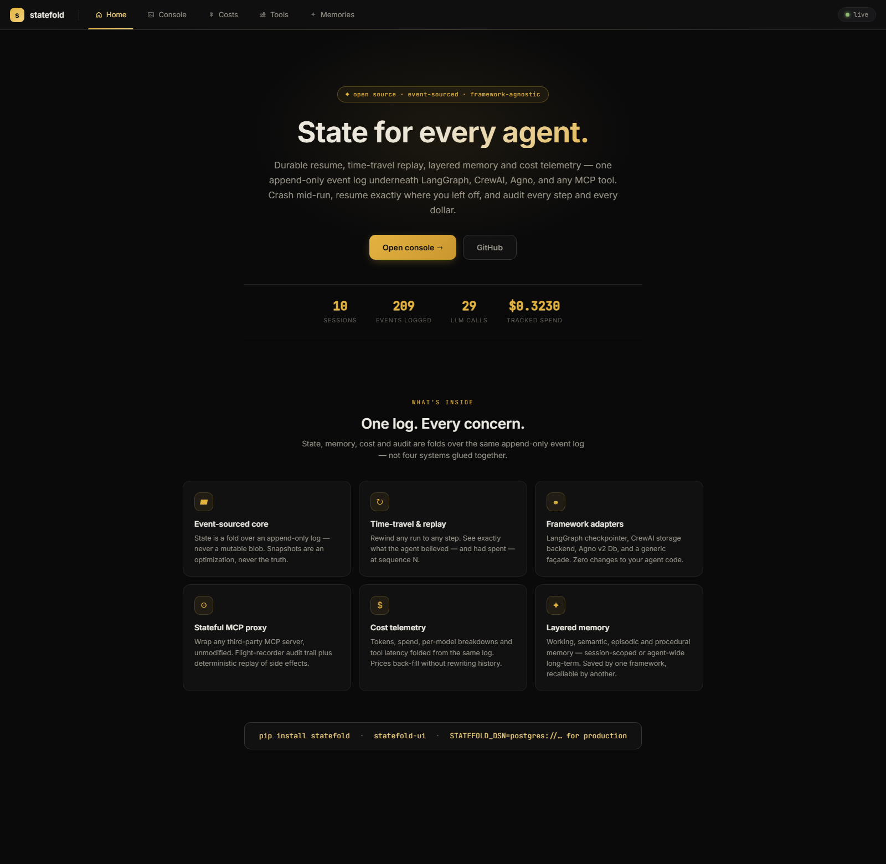
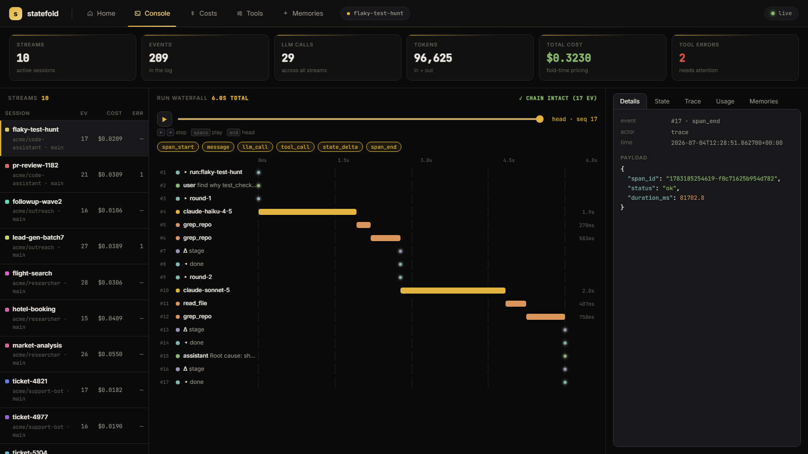

# statefold

[](https://github.com/Joshuaakaspace/statefold/actions/workflows/ci.yml)
[](LICENSE)

A framework-agnostic, event-sourced state platform for AI agents — works under
LangGraph, CrewAI, Agno, raw tools, or MCP.

> Built on top of [Statefold](https://github.com/ioteverythin/statefold)
> (Apache-2.0), an open-source event-sourced state library. This fork adds
> the OpenTelemetry exporter (`statefold/otel.py`) and SigNoz demo agent
> (`statefold/demo_signoz.py`) for the **Agents of SigNoz** hackathon.



*The observability console: KPI bar, per-session cost/error table, and a run
waterfall with a time-travel slider — replay any run step by step and watch
state and spend rewind.*



State is a **fold over an append-only event log**, not a mutable blob. That one
choice gives you durable resume, time-travel, replay, and cheap branching for
free — the things that turn "a memory library" into a platform.

## Why

Every agent framework has its own, incompatible state model (LangGraph
checkpointers, CrewAI memory, Agno storage) and MCP is stateless by design.
`statefold` is a neutral substrate they all plug into, so state is portable
across frameworks and shareable across agents.

## Quickstart (no services required)

```bash
pip install -e ".[dev]"
python -m statefold.demo      # crash+resume, time-travel, fork — all in-memory
pytest                          # the core guarantees, proven
```

```python
import asyncio
from statefold import InMemoryStore, Scope, Event

async def main():
    store = InMemoryStore()
    scope = Scope(tenant="acme", agent="researcher", session="sess-1")

    head = await store.append(scope, [
        Event(kind="message",     payload={"role": "user", "content": "book a hotel"}),
        Event(kind="state_delta", payload={"set": {"stage": "searching"}}),
    ], expected_seq=0)

    print(await store.get_state(scope))            # folded current state
    print(await store.get_state(scope, as_of=1))   # time-travel to seq 1

asyncio.run(main())
```

## Concepts

| Concept | What it is |
|---|---|
| `Scope` | Addresses state by `(tenant, agent, session, thread)`. A stream = one thread. |
| `Event` | Append-only unit with a gap-free per-stream `seq`. |
| Reducer | Pure `(state, payload) -> state`. Register your own event kinds via `@register`. |
| `expected_seq` | Optimistic concurrency — stale writes are rejected, callers retry. |
| `checkpoint` | A snapshot; a pure optimization, never the source of truth. |
| `fork` | O(1) branch of a stream for what-if runs and replays. |

## Backends

- `InMemoryStore` — tests, local dev, the example above.
- `PostgresStore` — durable production store (`pip install statefold[postgres]`).
  Append-only `events` table with `UNIQUE (stream, seq)`.

```python
from statefold.postgres import PostgresStore
store = await PostgresStore.connect("postgresql://localhost/statefold")
```

## UI — event-log inspector

A zero-build dashboard (`pip install statefold[ui]`, no npm):

```bash
statefold-ui                                    # in-memory + demo data
STATEFOLD_DSN=postgresql://... statefold-ui    # inspect a real store
# -> http://127.0.0.1:8787
```

Browse every stream, click through the event timeline, and **drag the
time-travel slider** to see the folded state and the usage/cost breakdown at
any sequence number. All read-only views over the same event log.

## SDK instrumentation (OpenAI, Anthropic, Google)

LLM client SDKs aren't frameworks, so they get instrumentation, not adapters:
wrap the client once and every completion call is auto-recorded as an
`llm_call` event — model, tokens, latency — feeding cost tracking and the
console with no manual calls:

```python
from statefold.instrument import instrument   # or instrument_openai / _anthropic / _google

client = instrument(OpenAI(), session)          # same client, now recorded
client.chat.completions.create(model="gpt-5", messages=[...])

instrument(Anthropic(), session)                # messages.create
instrument(genai.Client(), session)             # models.generate_content
```

Sync and async clients both work; wrapping is duck-typed (no SDK is a
dependency) and idempotent. Responses without a usage block (e.g. streaming
without `include_usage`) are recorded with zero tokens and a `no_usage`
marker — never silently dropped.

`capture_content=True` additionally logs the last user message and the
assistant reply as `message` events (opt-in, off by default for privacy and
payload size; captured messages are marked `captured: true` and truncated to
4k chars).

## Prod runs → evals (promptfoo)

statefold records what your agent *actually did*; `promptfoo` runs LLM evals.
Close the loop — turn any recorded session into a regression suite:

```bash
statefold-eval acme/support-bot/ticket-4821/main > promptfooconfig.json
npx promptfoo eval -c promptfooconfig.json
```

Each captured user→assistant exchange becomes a test whose `similar`
assertion is the answer that worked in production; recorded latency and cost
become `latency`/`cost` thresholds (with headroom), so a change that answers
correctly but slower or pricier still fails CI. Every test carries the source
stream + seq, so a failure links straight back to the run you can time-travel
into. Output is plain promptfoo JSON — no new dependency. (Requires
content capture; the console's per-stream **Download eval** endpoint
`/api/promptfoo` serves the same file.)

## Tracing

Spans are events in the same log — hash-chained, replayable, and
time-travelable like everything else. They nest automatically, and any
event recorded inside a span (LLM calls, tool calls, messages) links to it
via `causation_id`:

```python
async with s.span("plan-trip", city="paris"):
    await s.add_llm_call("claude-sonnet-5", 1200, 300)
    async with s.span("book-hotel"):
        await s.add_tool_call("book", {"hotel": "Lutetia"}, result="LUT-2231")

await s.trace()            # {span_id: {name, parent_id, status, duration_ms, ...}}
await s.trace(as_of=4)     # the span tree as it looked mid-run
```

Exceptions mark the span `error` and re-raise. The console's **Trace** tab
renders the nested tree with duration bars, status dots, and the events
attached to each span — and because spans are just events, you can scrub
the time-travel slider and watch the trace build up.

## OpenTelemetry export (SigNoz, Jaeger, any OTLP backend)

`OtelExporter` wraps a `SessionState` and mirrors `add_tool_call` /
`add_llm_call` into real OTel spans + metrics — nested under whatever span is
active on the current context (e.g. an auto-instrumented agent framework run),
in addition to the normal durable write-through. Purely additive: the event
log and hash chain are untouched.

```python
from opentelemetry import trace
from opentelemetry.exporter.otlp.proto.grpc.trace_exporter import OTLPSpanExporter
from opentelemetry.sdk.trace import TracerProvider
from opentelemetry.sdk.trace.export import BatchSpanProcessor
from statefold.otel import OtelExporter

provider = TracerProvider()
provider.add_span_processor(BatchSpanProcessor(OTLPSpanExporter(endpoint="http://localhost:4317", insecure=True)))
trace.set_tracer_provider(provider)

exporter = OtelExporter(session, agent="weather-bot")
await exporter.add_tool_call("get_weather", args={"city": "nyc"}, result="72F", latency_ms=120.0)
await exporter.add_llm_call("llama3.2:3b", input_tokens=50, output_tokens=20, latency_ms=430.0)
```

Emits `statefold.tokens` (counter), `statefold.cost_usd` (counter), and
`statefold.latency_ms` (histogram), tagged with `statefold.agent` and
model/tool name. Errors set `StatusCode.ERROR` on the span so a failing tool
call under an otherwise-green root span shows up red in any OTel-native UI.

See `statefold/demo_signoz.py` for a full Agno + Ollama + SigNoz demo (built
for the [Agents of SigNoz hackathon](https://github.com/aarieffawwaz/signoz_hackathon)).

## Tamper-evident log & runtime invariants

Every appended event is **hash-chained** (`sha256(prev_hash || event)`), so
editing, reordering, or deleting history breaks every hash after it — the
console shows a chain badge per stream, `/api/verify` and the MCP
`state_verify` tool recompute it on demand:

```python
from statefold import verify_chain
await verify_chain(store, scope)   # {"ok": True, "broken_at": None, "events": 132}
```

**Invariants** reject invalid writes *before* they persist — all-or-nothing
per batch, zero overhead when none are registered:

```python
from statefold import invariant, InvariantViolation

@invariant("llm_call")
def budget_cap(state, event):
    if state.get("usage", {}).get("cost_usd", 0) > 5.00:
        raise InvariantViolation("session budget exhausted")
```

## Live tail (SSE)

Every stream is subscribable — plain SSE, works with `curl -N`:

```bash
curl -N "http://127.0.0.1:8787/api/tail?stream=acme/bot/s1/main&after=0"
```

The console uses this for live updates while an agent runs.

## Benchmarks

Honest numbers from `python benchmarks/bench.py` (in-memory store, hash
chain enabled, one laptop core — Postgres throughput depends on your server,
run the script against your DSN):

| operation | events | rate |
|---|---|---|
| sequential appends (1/append) | 2,000 | ~57,000/s |
| batched appends (100/append) | 10,000 | ~99,000/s |
| fold (`get_state`, no snapshot) | 10,000 | ~3.6M events/s |
| `verify_chain` | 10,000 | ~103,000/s |

## Telemetry & cost

The event log *is* the telemetry — no separate collector, no double-writes.
`llm_call` events fold into a usage view, and everything the core gives you
applies to spend: time-travel ("what had this session cost as of step N?"),
per-tenant/session isolation, and a replayable billing audit.

```python
from statefold import register_pricing

register_pricing("claude-sonnet-5", input_per_mtok=3.00, output_per_mtok=15.00)

await s.add_llm_call("claude-sonnet-5", input_tokens=1200, output_tokens=450,
                     latency_ms=980)
u = await s.usage()          # {"llm_calls", "cost_usd", "by_model", "tools", ...}
await s.usage(as_of=40)      # spend as of step 40
```

Pricing is never hardcoded (prices change) — register your own, or pass an
explicit `cost_usd` per call. Registering prices *later* back-fills cost on
the next read, because cost is computed at fold time; the log never needs
rewriting. Unknown-model calls are surfaced as `uncosted_calls`, never a
silent $0. Tool latency and errors are aggregated automatically, including
for every call through the MCP proxy.

## Memory — the full cognitive taxonomy

statefold models the four memory types agents actually need, on two scopes:

| Type | What it holds | How |
|---|---|---|
| **Working** | current messages + state bag | the folded state itself — `session.working_memory()` |
| **Semantic** | facts, preferences | `remember(text)` (default kind) |
| **Episodic** | past experiences with provenance | `end_episode(summary, outcome=...)` / `recall_episodes(query)` |
| **Procedural** | learned how-tos | `learn_procedure(text)` |

**Levels:** `level="session"` dies with the session; `level="agent"` is true
long-term memory, shared across every session of that agent. Episodic and
procedural memories are agent-level by default — that's the point:

```python
# ticket-1 resolves an issue and records the experience
await run1.end_episode("resolved duplicate invoice by voiding the copy",
                       outcome="success")

# ticket-2, days later, a brand-new session:
episodes = await run2.recall_episodes("duplicate invoice problem")
# -> the past episode, with outcome + a stream ref you can time-travel into
```

`recall()` searches both levels by default and filters by `kind`/`level`.
Every episodic memory carries the source stream, so you can jump from
"I've seen this before" straight into replaying exactly what happened.

## Semantic recall

Bring any embedder (`(text) -> list[float]`, sync or async) and recall becomes
semantic; without one, stores fall back to lexical matching:

```python
store = InMemoryStore(embedder=my_embedder)
# Postgres: uses pgvector (HNSW, cosine) when the extension is available,
# otherwise ranks in Python over stored embeddings — same API either way.
store = await PostgresStore.connect(dsn, embedder=my_embedder, embedding_dim=1536)
```

Pre-computed vectors are also supported (`remember(..., embedding=...)`,
`recall_vec(...)`) for frameworks that embed upstream, like CrewAI.

## Adapters

Point an existing framework at the store — no changes to your agent code:

```python
from statefold import InMemoryStore
from statefold.adapters.langgraph import PlatformCheckpointer

store = InMemoryStore()  # or PostgresStore.connect(...)
graph = builder.compile(checkpointer=PlatformCheckpointer(store, tenant="acme", agent="researcher"))
# crash mid-run -> re-invoke with the same thread_id -> resumes from the event log
```

Every LangGraph checkpoint and pending-write becomes an event in the durable
log, so the log *is* the graph's memory — durable resume, history, and replay
come for free. See `tests/test_langgraph_adapter.py` for a crash-and-resume proof.

**CrewAI (>= 1.x)** — a `StorageBackend` for CrewAI's unified memory; every
`MemoryRecord` lives in the durable store and survives restarts:

```python
from statefold.adapters.crewai import AgentStateBackend

backend = AgentStateBackend(store, tenant="acme", agent="crew1")
# plug into CrewAI's memory as its storage backend
```

(A legacy `AgentStateStorage` for CrewAI 0.x `ExternalMemory` is also included.)

**Agno (v2)** — a `Db` whose sessions and user memories write through to the
event log and rehydrate on restart:

```python
from statefold.adapters.agno import AgentStateDb

db = AgentStateDb(store, tenant="acme", agent="assistant")
agent = Agent(db=db, add_history_to_context=True, ...)
# restart the process -> sessions and memories come back from the log
```

**Anything else** — the `SessionState` façade (no framework required):

```python
from statefold.adapters.generic import SessionState

s = SessionState(store, tenant="acme", agent="bot", session="sess-1")
await s.add_message("user", "book a hotel")
await s.set(stage="searching")
await s.remember("user prefers window seats")
```

Because every adapter writes to the same store, state is *shared across
frameworks*: a memory saved by an Agno agent is recallable by a CrewAI crew
or a raw MCP agent on the same scope.

## MCP state server

Any MCP-capable agent (raw, CrewAI, Agno, a Claude/GPT tool loop) gets durable
state by adding one server — no framework integration:

```bash
pip install -e ".[mcp]"
statefold-mcp                                   # in-memory (ephemeral)
STATEFOLD_DSN=postgresql://localhost/statefold statefold-mcp   # durable
```

Tools: `state_append`, `state_get` (with `as_of` time-travel), `state_head`,
`state_checkpoint`, `memory_remember`, `memory_recall`. `tenant`/`agent` come
from env so a client can't spoof another tenant's scope.

## Stateful MCP proxy

MCP servers are stateless per call by design. The proxy wraps **any**
third-party MCP server, unmodified: it mirrors the downstream's tools 1:1 and
records every call + result as events in the durable log.

```bash
statefold-mcp-proxy -- npx -y @modelcontextprotocol/server-filesystem C:/data
STATEFOLD_REPLAY=1 statefold-mcp-proxy -- <cmd...>   # deterministic replay
```

You get an auditable, time-travelable history of every MCP interaction per
session — and with `STATEFOLD_REPLAY=1`, identical calls return the recorded
result without re-executing side effects (reproduce a run exactly, or resume
one safely).

## Roadmap

- [x] Event-sourced core (in-memory + Postgres)
- [x] LangGraph `BaseCheckpointSaver` adapter
- [x] MCP state server (any agent gets state by adding one server)
- [x] Stateful MCP proxy (wrap any third-party MCP server, unmodified)
- [x] CrewAI 1.x StorageBackend + Agno v2 Db adapter + generic façade
- [x] Semantic recall: pluggable embedders, pgvector with automatic fallback
- [x] Tamper-evident hash chain + `verify_chain` (API, MCP tool, console badge)
- [x] Runtime invariants (reject invalid writes, all-or-nothing batches)
- [x] SSE event tail for live subscriptions
- [x] Tracing: nested spans as events + console trace tree
- [x] OpenTelemetry exporter — `statefold/otel.py`, `OtelExporter` (built for [Agents of SigNoz](https://github.com/aarieffawwaz/signoz_hackathon))
- [ ] TypeScript SDK over the same HTTP/MCP surface

## AI disclosure

Built for **Agents of SigNoz** (WeMakeDevs hackathon). The OTel exporter
(`statefold/otel.py`), demo agent (`statefold/demo_signoz.py`), and this
README/CHANGELOG section were built with AI pair-programming assistance
(Claude Code), reviewed and edited by the author before submission.

## License

Apache-2.0
